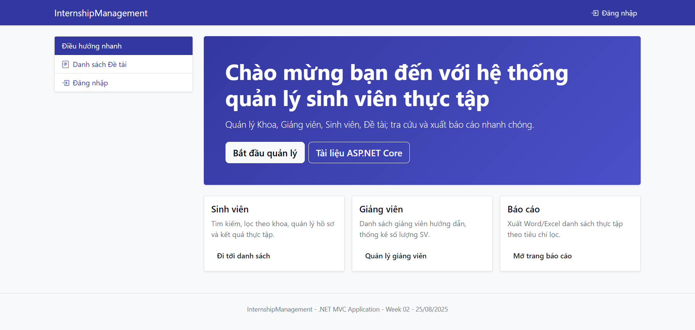
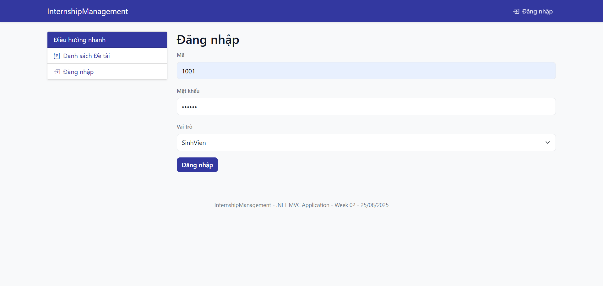
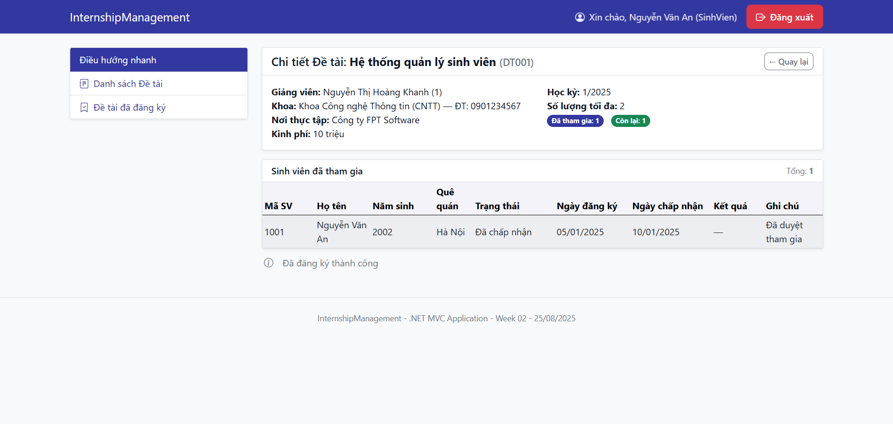
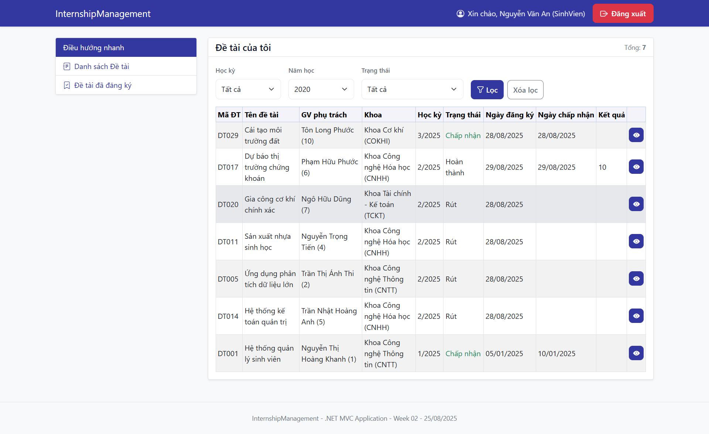
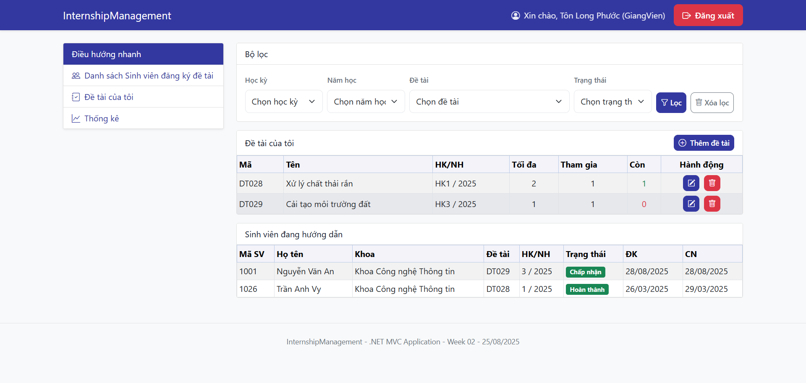
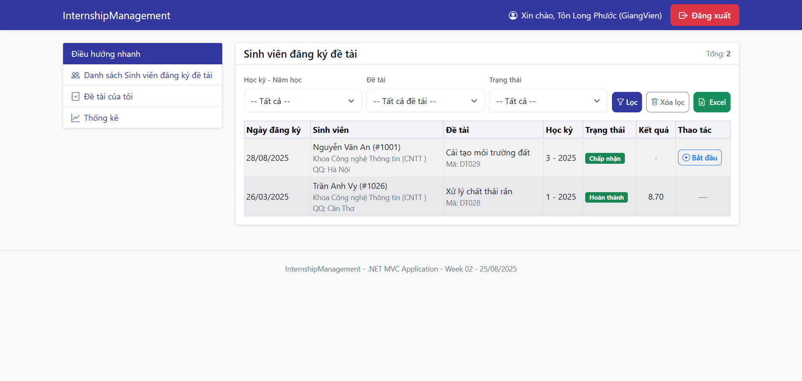
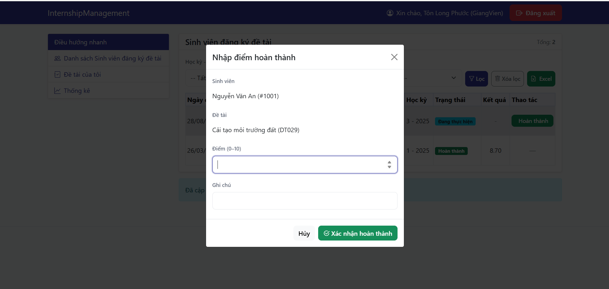
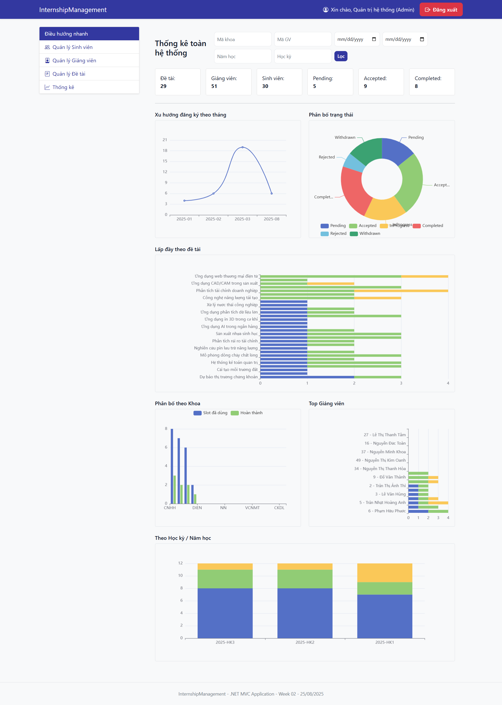
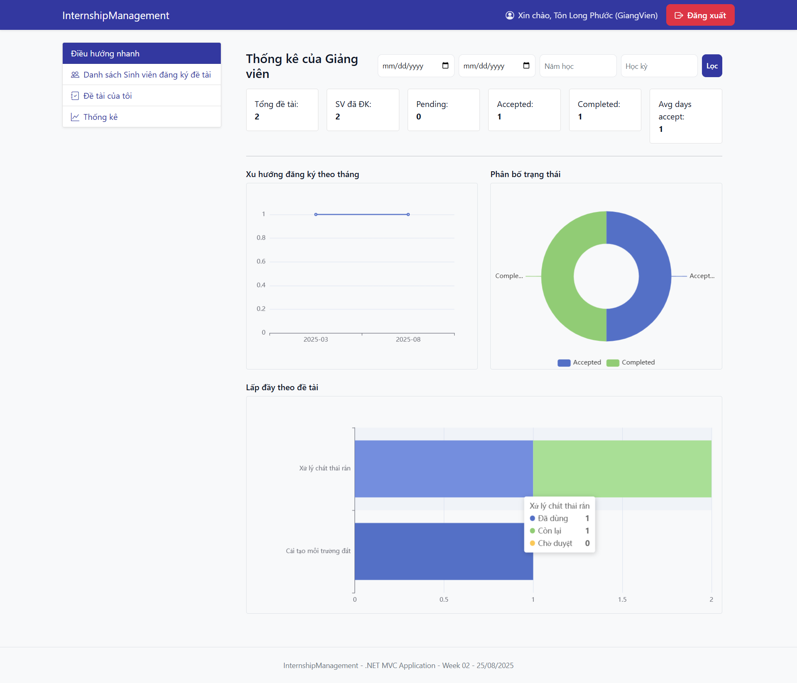
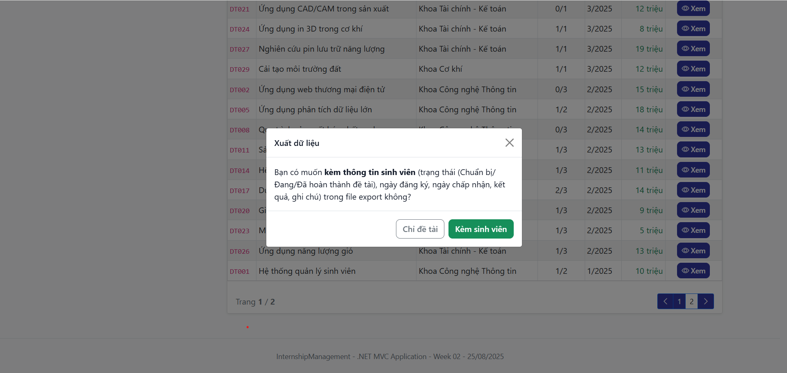

# InternshipManagement — Mini Project (ASP.NET MVC + SQL Server)

Một mini-project quản lý đề tài/đồ án thực tập với 3 vai trò **Sinh viên**, **Giảng viên**, **Admin**. Stack chính: **.NET 8 (ASP.NET MVC + EF Core)**, **SQL Server**.

---

## 🧰 Yêu cầu hệ thống (Prerequisites)

* .NET SDK **8.x** (hoặc cao hơn)
* SQL Server (LocalDB/Express hoặc Docker) + SSMS / Azure Data Studio
* EF Core CLI
---

## ⚡️ Khởi động nhanh (TL;DR)

```bash
# 1) Clone & vào thư mục
git clone <YOUR_REPO_URL> InternshipManagement
cd InternshipManagement

# 2) Cập nhật chuỗi kết nối trong appsettings.json
#    (ví dụ cho SQL Server local)
# "Default": "Server=localhost,1433;Database=ThucTap;User Id=sa;Password=sapassword;TrustServerCertificate=True;"

# 3) Tạo/migrate database
dotnet ef database update

# 4) Chạy lần đầu để khởi tạo dữ liệu đăng nhập (Identity)
dotnet run

# 5) Import các Stored Procedure
#    Mở file /Database/StoredProcedures/thuctap_stored_procs.sql trong SSMS/Azure Data Studio và Execute

# 6) Đăng nhập theo tài khoản mặc định (xem bên dưới)
```
---
## 🗃️ Migrate Database

> Project đã cấu hình seeding dữ liệu tĩnh bằng `HasData` trong `SeedData.Seed(ModelBuilder mb)`. Vì vậy chỉ cần chạy **migrate** là dữ liệu danh mục cơ bản sẽ có.

Chạy lệnh migrate & update DB:

```bash
# Tạo DB và áp dụng các migration hiện có
dotnet ef database update
```

> Nếu bạn mới sửa model và muốn tạo migration mới:
>
> ```bash
> dotnet ef migrations add Init
> dotnet ef database update
> ```

---

## 🌱 Seed data

Project đang seeding danh mục qua `HasData` (ví dụ `Khoa`, …) trong `InternshipManagement.Data.SeedData`:

```csharp
public static class SeedData
{
    public static void Seed(ModelBuilder mb)
    {
        mb.Entity<Khoa>().HasData(
            new Khoa { MaKhoa = "CNTT", TenKhoa = "Khoa Công nghệ Thông tin", DienThoai = "0901234567" },
            new Khoa { MaKhoa = "CNHH", TenKhoa = "Khoa Công nghệ Hóa học", DienThoai = "0901234572" },
            new Khoa { MaKhoa = "TCKT", TenKhoa = "Khoa Tài chính - Kế toán", DienThoai = "0901234576" },
            new Khoa { MaKhoa = "COKHI", TenKhoa = "Khoa Cơ khí", DienThoai = "0901234570" },
            new Khoa { MaKhoa = "VCNMT", TenKhoa = "Viện Công nghệ & Môi trường", DienThoai = "0901234582" },
            new Khoa { MaKhoa = "DTVT", TenKhoa = "Khoa Điện tử - Viễn thông", DienThoai = "0901234568" },
            new Khoa { MaKhoa = "DIEN", TenKhoa = "Khoa Điện - Điện tử", DienThoai = "0901234569" }
            // ... (các seed khác nếu có)
        );
    }
}
```

* **Bước chạy:**

  * `dotnet ef database update` (áp dụng migration + seed danh mục)
  * `dotnet run` lần đầu để tạo **tài khoản đăng nhập** (Identity) nếu code khởi tạo người dùng mặc định chạy ở `Program.cs`/`ApplicationDbInitializer`.

### 🔑 Tài khoản mặc định

* **Sinh viên:** *username* = **Mã SV** (ID), *password* = **123456**
* **Giảng viên:** *username* = **Mã GV** (ID), *password* = **123456**
* **Admin:** *username* = **admin**, *password* = **admin123**

> *Lưu ý:* Tạo đúng dữ liệu người dùng mẫu (seed Identity) theo logic dự án (ví dụ đọc từ file seed hoặc tạo cứng). Nếu bạn không thấy tài khoản xuất hiện, kiểm tra code khởi tạo trong `Program.cs`/`DbInitializer` và chạy lại `dotnet run`.

---

## 🧩 Thêm Stored Procedures

* Mở file: **`/Database/StoredProcedures/thuctap_stored_procs.sql`**
* Chạy toàn bộ script trong SSMS/Azure Data Studio để tạo/cập nhật các **Stored Procedure** cần thiết.

> Ví dụ: các SP phục vụ danh sách đề tài, đăng ký, thống kê,… (chi tiết trong file SQL).

---

## ▶️ Chạy dự án

```bash
dotnet run
# hoặc F5 trong Visual Studio / VS Code
```

Ứng dụng lắng nghe ở `https://localhost:xxxx` (xem console khi chạy lần đầu).

---

## 👤👨‍🏫🛠️ Chức năng theo vai trò

### 1) Sinh viên

* Xem **danh sách đề tài** (filter theo nhiều thuộc tính: khoa, giảng viên, học kỳ, trạng thái, …)
* **Đăng ký** đề tài
* **Thu hồi** khi đã đăng ký
* Xem **danh sách đề tài đã đăng ký** của bản thân

### 2) Giảng viên

* Xem **danh sách đề tài của bản thân**
* Xem **danh sách sinh viên đang hướng dẫn**
* Xem **danh sách sinh viên đã đăng ký đề tài**
* Thao tác **Chấp nhận / Từ chối** đăng ký
* Cập nhật **Trạng thái: Đang làm / Hoàn thành**
* **Nhập điểm kết quả** cho đồ án
* Xem **thống kê tình trạng** các đề tài của bản thân

### 3) Admin

* CRUD **Sinh viên**
* CRUD **Giảng viên**
* Xem **thống kê đăng ký đề tài** toàn hệ thống
* Xem **danh sách đề tài** toàn hệ thống
* **Export** danh sách theo bộ lọc (tuỳ chọn **xuất kèm danh sách đề tài** hay không)

---

## 🖼️ Khu vực ảnh minh hoạ (điền ảnh vào README)

> Bạn chụp màn hình theo gợi ý dưới đây rồi thay các liên kết ảnh:

* Trang chủ/Đăng nhập: ``
* Danh sách đề tài (Sinh viên) + thanh filter: ``
* Đăng ký/Thu hồi đề tài: ``
* Danh sách đề tài đã đăng ký (SV): ``
* Danh sách đề tài của tôi (GV): ``
* Duyệt đăng ký (GV): ``
* Cập nhật trạng thái & nhập điểm (GV): ``
* Thống kê đề tài (GV): ``
* Quản trị CRUD SV: ``
* Quản trị CRUD GV: ``
* Thống kê toàn hệ thống (Admin): ``
* Export theo filter (Admin): ``

> **Lưu ý:** Tạo thư mục `docs/images/` trong repo để quản lý ảnh.

---

## 🧪 Lệnh hữu ích (Cheat Sheet)

```bash
# Tạo migration mới
dotnet ef migrations add <Name>

# Áp dụng migration
dotnet ef database update

# Huỷ migration cuối (khi chưa update DB)
dotnet ef migrations remove

# Recreate DB từ đầu (cẩn thận xoá dữ liệu!)
dotnet ef database drop -f && dotnet ef database update
```

---

## 🛟 Troubleshooting

* **Không kết nối được DB:** kiểm tra firewall/port, `TrustServerCertificate=True` cho môi trường dev, User/Pass đúng.
* **Seed Identity không chạy:** đảm bảo khối **khởi tạo người dùng mặc định** được gọi khi `dotnet run` lần đầu (ví dụ `using var scope = app.Services.CreateScope(); await DbInitializer.SeedAsync(scope.ServiceProvider);`).
* **Lỗi migration:** xoá DB dev và chạy lại `dotnet ef database update`.
* **Không thấy Stored Procedures:** chắc chắn đã mở và **Execute** file `thuctap_stored_procs.sql` đúng database `ThucTap`.

---

# InternshipManagement — Mini Project (ASP.NET MVC + SQL Server)

Một mini-project quản lý đề tài/đồ án thực tập với 3 vai trò **Sinh viên**, **Giảng viên**, **Admin**. Stack chính: **.NET 8 (ASP.NET MVC + EF Core)**, **SQL Server**.

---

## 🧰 Yêu cầu hệ thống (Prerequisites)

* .NET SDK **8.x** (hoặc cao hơn)
* SQL Server (LocalDB/Express hoặc Docker) + SSMS / Azure Data Studio
* EF Core CLI

  ```bash
  dotnet tool update --global dotnet-ef
  ```
---

## ⚡️ Khởi động nhanh (TL;DR)

```bash
# 1) Clone & vào thư mục
git clone <YOUR_REPO_URL> InternshipManagement
cd InternshipManagement

# 2) Cập nhật chuỗi kết nối trong appsettings.json
#    (ví dụ cho SQL Server local)
# "DefaultConnection": "Server=localhost,1433;Database=ThucTap;User Id=sa;Password=sapassword;TrustServerCertificate=True;"

# 3) Tạo/migrate database
dotnet ef database update

# 4) Chạy lần đầu để khởi tạo dữ liệu đăng nhập (Identity)
dotnet run

# 5) Import các Stored Procedure
#    Mở file /Database/StoredProcedures/thuctap_stored_procs.sql trong SSMS/Azure Data Studio và Execute

# 6) Đăng nhập theo tài khoản mặc định (xem bên dưới)
```

---

## 🔧 Cấu hình chuỗi kết nối

File `appsettings.json` (ví dụ):

```json
{
  "ConnectionStrings": {
    "DefaultConnection": "Server=localhost,1433;Database=ThucTap;User Id=sa;Password=sapassword;TrustServerCertificate=True;"
  },
  "Logging": { "LogLevel": { "Default": "Information", "Microsoft.AspNetCore": "Warning" } },
  "AllowedHosts": "*"
}
```

> Nếu dùng **LocalDB** trên Windows: `Server=(localdb)\\MSSQLLocalDB;Database=ThucTap;Trusted_Connection=True;MultipleActiveResultSets=true`

---

## 🗃️ Migrate Database

> Project đã cấu hình seeding dữ liệu tĩnh bằng `HasData` trong `SeedData.Seed(ModelBuilder mb)`. Vì vậy chỉ cần chạy **migrate** là dữ liệu danh mục cơ bản sẽ có.

Chạy lệnh migrate & update DB:

```bash
# Tạo DB và áp dụng các migration hiện có
dotnet ef database update
```

> Nếu bạn mới sửa model và muốn tạo migration mới:
>
> ```bash
> dotnet ef migrations add Init
> dotnet ef database update
> ```

---

## 🌱 Seed data

Project đang seeding danh mục qua `HasData` (ví dụ `Khoa`, …) trong `InternshipManagement.Data.SeedData`:

```csharp
public static class SeedData
{
    public static void Seed(ModelBuilder mb)
    {
        mb.Entity<Khoa>().HasData(
            new Khoa { MaKhoa = "CNTT", TenKhoa = "Khoa Công nghệ Thông tin", DienThoai = "0901234567" },
            new Khoa { MaKhoa = "CNHH", TenKhoa = "Khoa Công nghệ Hóa học", DienThoai = "0901234572" },
            new Khoa { MaKhoa = "TCKT", TenKhoa = "Khoa Tài chính - Kế toán", DienThoai = "0901234576" },
            new Khoa { MaKhoa = "COKHI", TenKhoa = "Khoa Cơ khí", DienThoai = "0901234570" },
            new Khoa { MaKhoa = "VCNMT", TenKhoa = "Viện Công nghệ & Môi trường", DienThoai = "0901234582" },
            new Khoa { MaKhoa = "DTVT", TenKhoa = "Khoa Điện tử - Viễn thông", DienThoai = "0901234568" },
            new Khoa { MaKhoa = "DIEN", TenKhoa = "Khoa Điện - Điện tử", DienThoai = "0901234569" }
            // ... (các seed khác nếu có)
        );
    }
}
```

* **Bước chạy:**

  * `dotnet ef database update` (áp dụng migration + seed)
  * `dotnet run` lần đầu để tạo **tài khoản đăng nhập** (Identity) 

### 🔑 Tài khoản mặc định

* **Sinh viên:** *username* = **Mã SV** (ID), *password* = **123456**
* **Giảng viên:** *username* = **Mã GV** (ID), *password* = **123456**
* **Admin:** *username* = **admin**, *password* = **admin123**

> *Lưu ý:* Tạo đúng dữ liệu người dùng mẫu (seed Identity) theo logic dự án (ví dụ đọc từ file seed hoặc tạo cứng). Nếu bạn không thấy tài khoản xuất hiện, kiểm tra code khởi tạo trong `Program.cs`/`DbInitializer` và chạy lại `dotnet run`.

---

## 🧩 Thêm Stored Procedures

* Mở file: **`/Database/StoredProcedures/thuctap_stored_procs.sql`**
* Chạy toàn bộ script trong SSMS/Azure Data Studio để tạo/cập nhật các **Stored Procedure** cần thiết.
---

## ▶️ Chạy dự án

```bash
dotnet run
# hoặc chạy trong Visual Studio 
```

Ứng dụng lắng nghe ở `https://localhost:7122` 

---

## 👤👨‍🏫🛠️ Chức năng theo vai trò

### 1) Sinh viên

* Xem **danh sách đề tài** (filter theo nhiều thuộc tính: khoa, giảng viên, học kỳ, trạng thái, …)
* **Đăng ký** đề tài
* **Thu hồi** khi đã đăng ký
* Xem **danh sách đề tài đã đăng ký** của bản thân

### 2) Giảng viên

* Xem **danh sách đề tài của bản thân**
* Xem **danh sách sinh viên đang hướng dẫn**
* Xem **danh sách sinh viên đã đăng ký đề tài**
* Thao tác **Chấp nhận / Từ chối** đăng ký
* Cập nhật **Trạng thái: Đang làm / Hoàn thành**
* **Nhập điểm kết quả** cho đồ án
* Xem **thống kê tình trạng** các đề tài của bản thân

### 3) Admin

* CRUD **Sinh viên**
* CRUD **Giảng viên**
* Xem **thống kê đăng ký đề tài** toàn hệ thống
* Xem **danh sách đề tài** toàn hệ thống
* **Export** danh sách theo bộ lọc (tuỳ chọn **xuất kèm danh sách đề tài** hay không)

---

## 🖼️ Khu vực ảnh minh hoạ

> Bạn chụp màn hình theo gợi ý dưới đây rồi thay các liên kết ảnh:

- Trang chủ: 
- Đăng nhập: 
- Danh sách đề tài (Sinh viên) + thanh filter: 
- Chi tiết đề tài: 
- Danh sách đề tài đã đăng ký (SV): 
- Danh sách đề tài của tôi (GV): 
- Duyệt đăng ký (GV) - Danh sách sinh viên đăng ký đề tài: 
- Cập nhật trạng thái & nhập điểm (GV): 
- Thống kê toàn hệ thống (Admin): 
- Thống kê theo giảng viên: 
- Export theo filter (Admin) — có thể chỉ export danh sách đề tài hoặc kèm danh sách sinh viên: 


> **Lưu ý:** Tạo thư mục `docs/images/` trong repo để quản lý ảnh.

## 📁 Cấu trúc thư mục (theo repo hiện tại)

```
InternshipManagement/
├─ Controllers/              # Các controller xử lý request HTTP, định tuyến tới action và trả về view hoặc dữ liệu
├─ Data/                     # Lớp DbContext, cấu hình EF Core, seeding dữ liệu
├─ Database/                 # Tài nguyên database thủ công
│  └─ StoredProcedures/      # Các script T-SQL định nghĩa Stored Procedure
│     └── thuctap_stored_procs.sql
├─ Migrations/               # Các file migration của EF Core
├─ Models/                   # Các model ứng dụng
│  ├─ Auth/                  # Model liên quan đến Identity, tài khoản, quyền
│  ├─ DTOs/                  # Data Transfer Objects dùng cho API / truyền dữ liệu
│  ├─ Enums/                 # Các kiểu liệt kê (enum)
│  └─ ViewModels/            # ViewModel cho Razor View
├─ Properties/               # Thông tin cấu hình dự án (launchSettings.json)
├─ Repositories/             # Pattern Repository
│  ├─ Implementations/       # Hiện thực các interface repository
│  └─ Interfaces/            # Khai báo interface repository
├─ Views/                    # Razor Views (giao diện)
│  ├─ Auth/                  # Giao diện đăng nhập/đăng ký
│  ├─ DeTai/                 # Giao diện quản lý đề tài
│  ├─ GiangVien/             # Giao diện cho giảng viên
│  ├─ Home/                  # Trang chủ
│  ├─ Shared/                # Layout, partial view dùng chung
│  ├─ SinhVien/              # Giao diện cho sinh viên
│  └─ ThongKe/               # Giao diện thống kê
├─ wwwroot/                  # Tài nguyên tĩnh (static files)
│  ├─ css/                   # Stylesheet
│  ├─ js/                    # Script JavaScript
│  └─ lib/                   # Thư viện front-end (Bootstrap, ECharts, jQuery...)
│     ├─ bootstrap/
│     ├─ bootstrap-icons/
│     ├─ echarts/
│     ├─ jquery/
│     ├─ jquery-validation/
│     └─ jquery-validation-unobtrusive/
├─ appsettings.json          # File cấu hình chính (connection string, logging...)
└─ Program.cs                # Điểm khởi chạy ứng dụng
```
---
