# 🎓 Internship Management System

## 📋 Giới thiệu dự án

**Internship Managements** Mini Project phục vụ cho mục đích review kiến thức ASP.NET MVC và Entity Framework Core. Hệ thống hỗ trợ 3 vai trò chính: **Sinh viên**, **Giảng viên** và **Admin**.

### ✨ Tính năng nổi bật
- 🔐 **Xác thực đa vai trò** với ASP.NET Identity
- 📊 **Dashboard thống kê** với biểu đồ (Đang update)
- 🔍 **Tìm kiếm và lọc** với nhiều trường dữ liệu
- 📤 **Export dữ liệu** Excel có thể kết hợp với filter để export dữ liệu mà người dùng mong muốn
- 📤 **Import dữ liệu** Excel
- 🎨 **Giao diện responsive** với Bootstrap 5
- ⚡ **Performance tối ưu** sử dụng Entity Framework kết hợp với LINQ để thao tác truy vấn, xử lý dữ liệu

---

## 🧰 Yêu cầu hệ thống

- **Framework:** .NET 8.0 hoặc cao hơn
- **Database:** SQL Server
- **IDE:** Visual Studio 2022, VS Code, hoặc Rider
- **Công cụ:** SQL Server Management Studio/Azure Data Studio

---

## 🚀 Cài đặt và chạy

### 1. Clone và thiết lập
```bash
git clone https://github.com/iamKhang/internship-management.git
cd internship-management/InternshipManagement
```

### 2. Cấu hình Database
Cập nhật chuỗi kết nối trong `appsettings.json`:
```json
{
  "ConnectionStrings": {
    "DefaultConnection": "Server=localhost,1433;Database=ThucTap;User Id=sa;Password=sapassword;TrustServerCertificate=True;"
  }
}
```

### 3. Khởi tạo Database
```bash
# Tải depedencies
dotnet restore
# Áp dụng migrations và seed data
dotnet ef database update
# Chạy ứng dụng lần đầu để tạo tài khoản
dotnet run -- --seed
```

### 4. Import Stored Procedures
Mở file `Database/StoredProcedures/thuctap_stored_procs.sql` và execute trong SSMS/Azure Data Studio. (Update: Không cần nữa vì đã thay thế bằng cách sử dụng EF)

### 5. Truy cập ứng dụng
```
URL: http://localhost:5084/
```

---

## 👥 Tài khoản đăng nhập

| Vai trò | Username | Password |
|---------|----------|----------|
| Sinh viên | 1001-1090 | 123456 |
| Giảng viên | 1-90 | 123456 |
| Admin | admin | admin123 |

---

## 🎯 Chức năng chính

### 👨‍🎓 Sinh viên
- ✅ **Xem danh sách đề tài** với bộ lọc nâng cao
- ✅ **Đăng ký/Thu hồi** đề tài
- ✅ **Xem đề tài đã đăng ký** của bản thân
- ✅ **Theo dõi trạng thái** sau khi đăng ký đề tài

### 👨‍🏫 Giảng viên
- ✅ **Quản lý đề tài** của bản thân
- ✅ **Duyệt/Từ chối hướng dẫn** sinh viên
- ✅ **Cập nhật tiến trình** hướng dẫn sinh viên thực hiện đề tài
- ✅ **Nhập điểm** kết quả (Sau khi cập nhật trạng thái hoàn thành hướng dẫn)
- ✅ **Thống kê** giảng viên xem thống kê tình trạng đăng kí đề tài của bản thân hiện tại

### 🛠️ Admin
- ✅ **CRUD Sinh viên & Giảng viên**
- ✅ **Thống kê toàn hệ thống** Xem thống kê tình trạng đăng ký học phần của hệ thống
- ✅ **Export dữ liệu** Export Danh sách Sinh viên/Danh sách giảng viên/Danh sách Đề tại (Có tùy chọn export cùng với các sinh viên đăng ký đề tài đó) ===> Cho người dùng chọn các trường cần export
- ✅ **Import dữ liệu** Import danh sách Sinh Viên/Giảng Viên nhanh bằng file excel.
- ✅ **Quản lý danh mục**  
<span style="color:red">*Lưu ý: Khi người dùng tạo Sinh viên/Giảng viên mới thì hệ thống sẽ tự động tạo tài khoản đăng nhập cho họ với mật khẩu là 123456*</span>
---

## 🏗️ Kiến trúc và Công nghệ

### Backend Stack
- **Framework:** ASP.NET Core 8.0 MVC
- **ORM:** Entity Framework Core 8.0
- **Database:** SQL Server với Stored Procedures
- **Authentication:** ASP.NET Core Identity
- **Architecture:** Repository Pattern + Dependency Injection

### Frontend Stack
- **UI Framework:** Bootstrap 5
- **Icons:** Bootstrap Icons
- **Charts:** ECharts
- **JavaScript:** jQuery

### Database Design
- **Tables:** 7 entities chính + Identity tables
- **Relationships:** One-to-Many, Many-to-Many
- **Stored Procedures:** 5+ SP cho truy vấn phức tạp (Đã bỏ)
- **Seed Data:** 90 sinh viên, 90 giảng viên, 450 đề tài

---

## 📁 Cấu trúc dự án

```
InternshipManagement/
├── Controllers/           # API Controllers
├── Data/                  # DbContext & Seed Data
├── Models/                # Domain Models
│   ├── Auth/             # Identity Models
│   ├── DTOs/             # Data Transfer Objects
│   ├── Enums/            # Enumeration Types
│   └── ViewModels/       # View Models
├── Repositories/          # Repository Pattern
├── Views/                # Razor Views
├── wwwroot/              # Static Files
└── Database/             # SQL Scripts
```

---

## 📊 Screenshots

### 🔐 Đăng nhập hệ thống
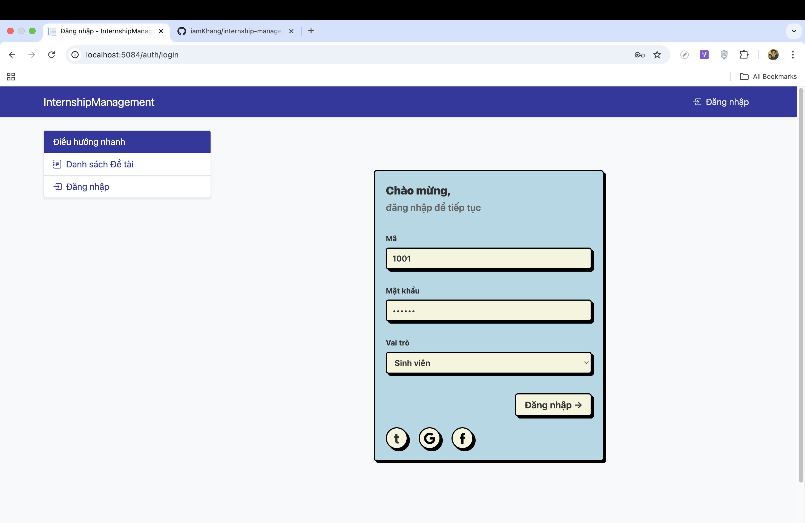

### 👨‍🎓 Admin - Danh sách đề tài
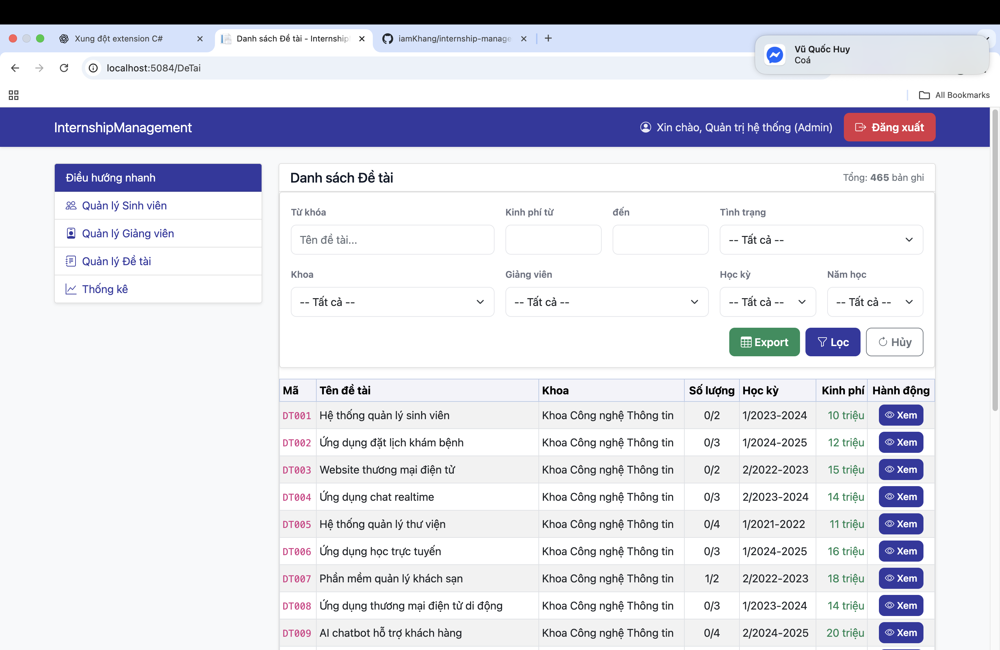

### 📋 Chi tiết đề tài

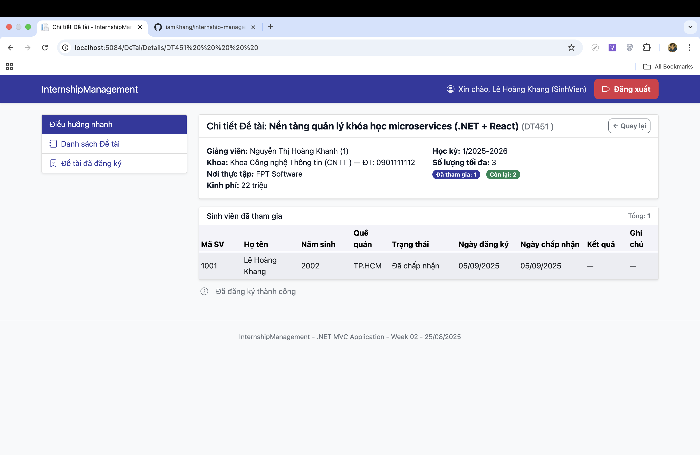
<span style="color:red">*Lưu ý: Tùy vào tình trạng của sinh viên với đề tài mà các nút sẽ hiển thị khác nhau (Đang chờ duyệt/Đã đăng ký/Bị từ chối/Quá thời gian đăng ký*</span>

### 📝 Đề tài đã đăng ký
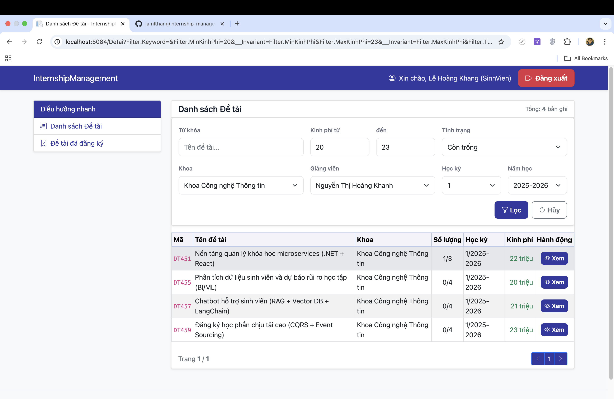

### 👨‍🏫 Giảng viên - Quản lý đề tài
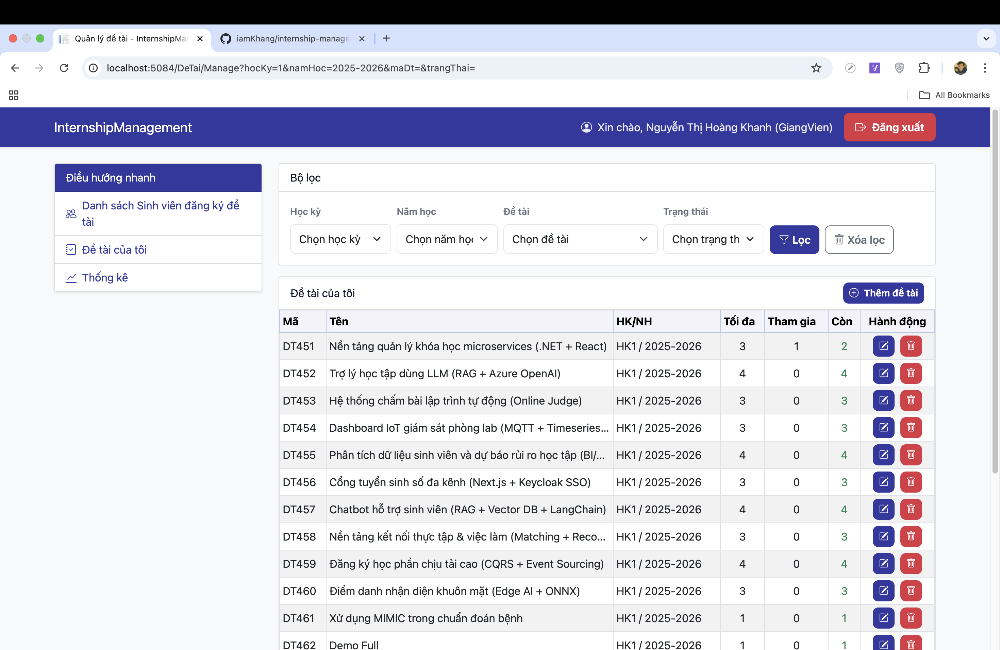
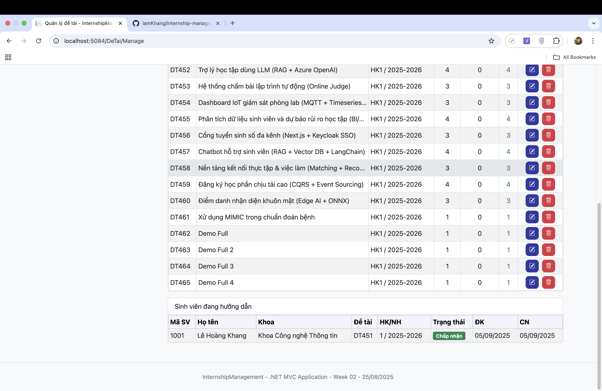

### 👥 Danh sách sinh viên đăng ký


### 📊 Nhập điểm kết quả


### 📈 Thống kê Admin

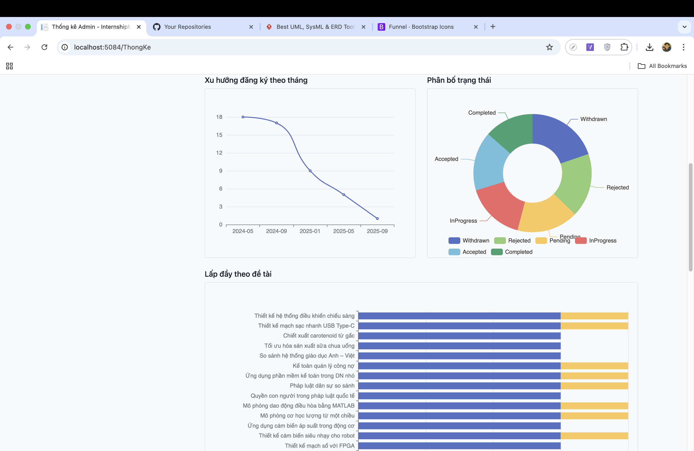
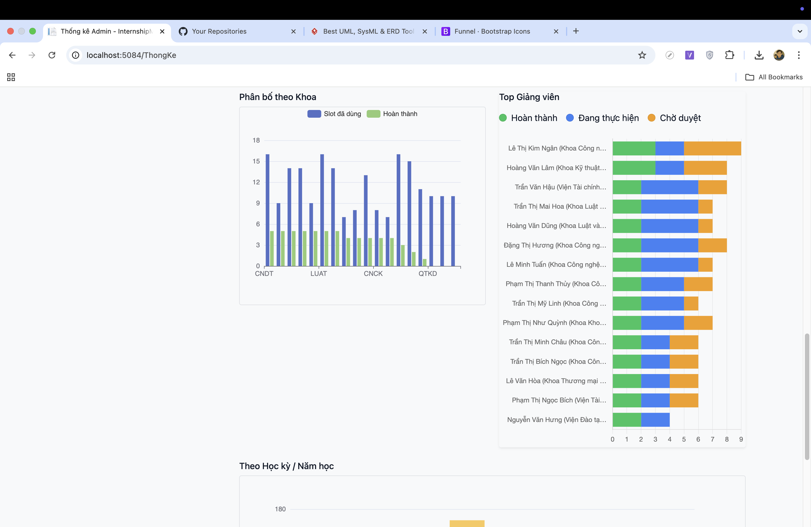

### 📊 Thống kê theo giảng viên
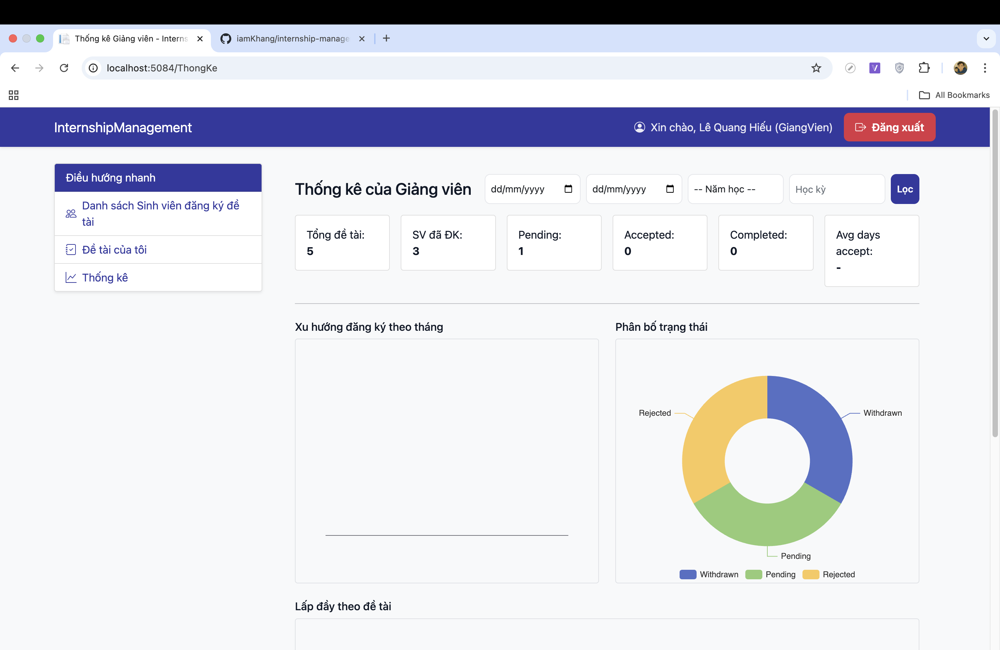

### 📤 Export dữ liệu
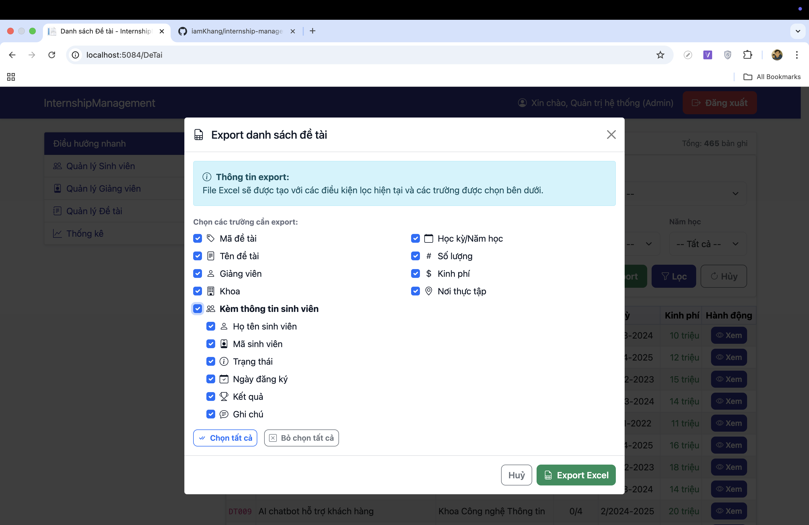
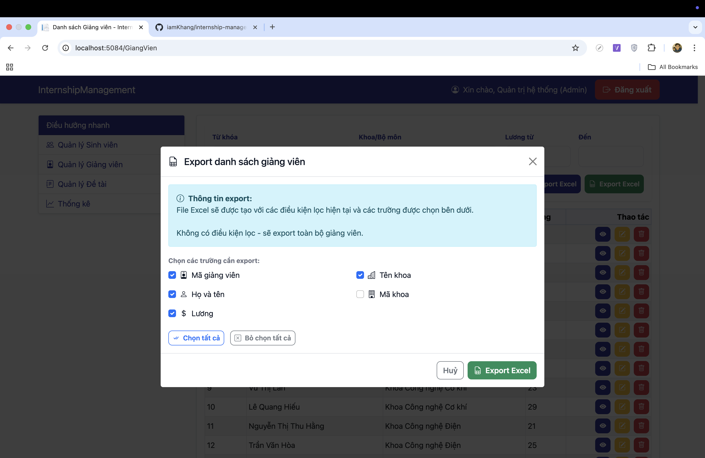
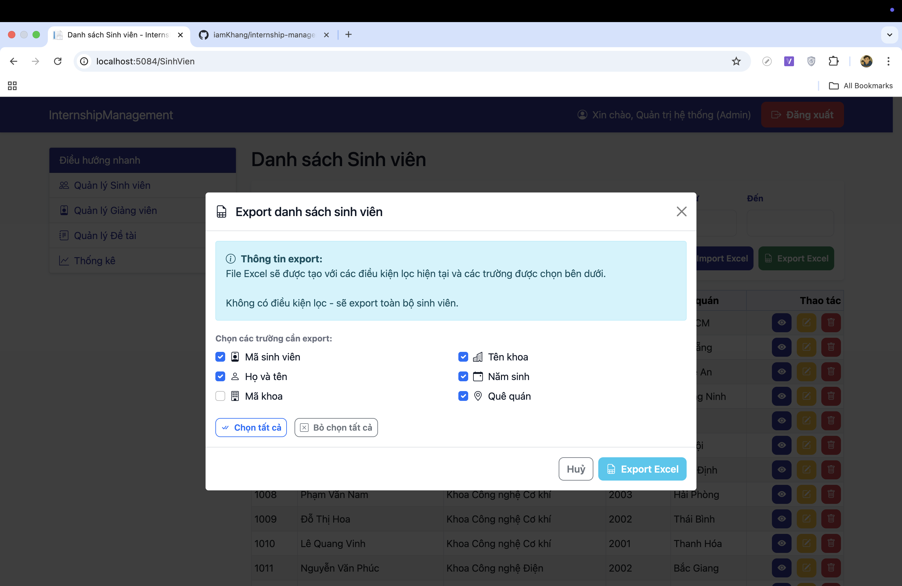


### 📤 Import dữ liệu
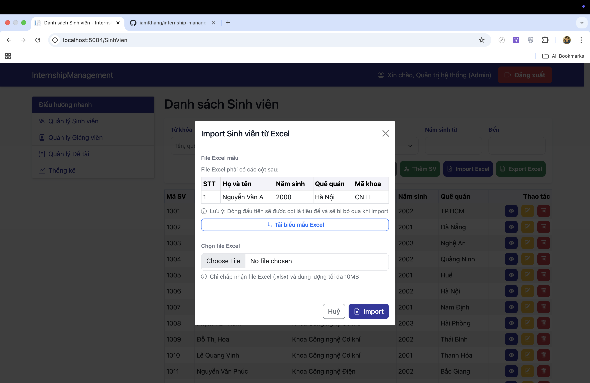
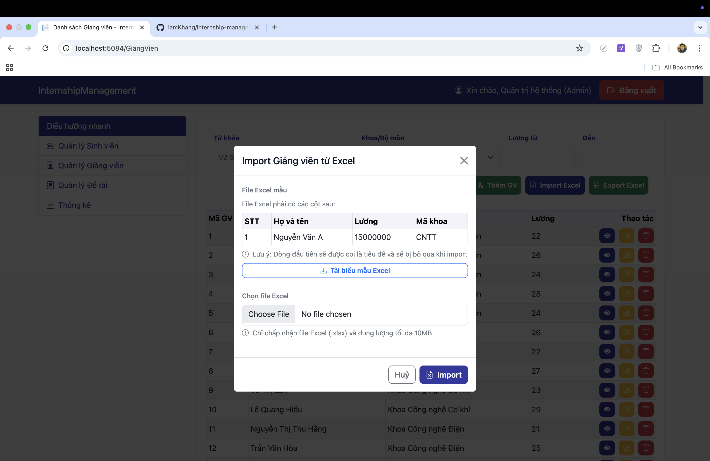
---

## 🔧 Troubleshooting

### Database Connection
```bash
# Kiểm tra kết nối
dotnet ef database update

# Reset database
dotnet ef database drop -f
dotnet ef database update
```

### Identity Seed
```bash
# Chạy lại seeding
dotnet run -- --seed
```

### Stored Procedures
- Đảm bảo đã execute file `thuctap_stored_procs.sql`
- Kiểm tra database name: `ThucTap`

---

## 👨‍💻 Tác giả

**Lê Hoàng Khang**

- 📧 Email: iamhoangkhang@icloud.com
- 📱 Phone: (+84) 383 741 xxx

---

## 📝 License

This project is developed for educational purposes.

---

<div align="center">
  <strong>🎓 Internship Management System - Review ASP MVC - Update (5/9/2025)</strong>
</div>
